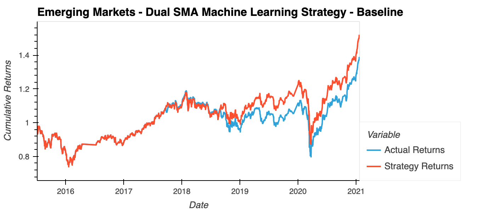
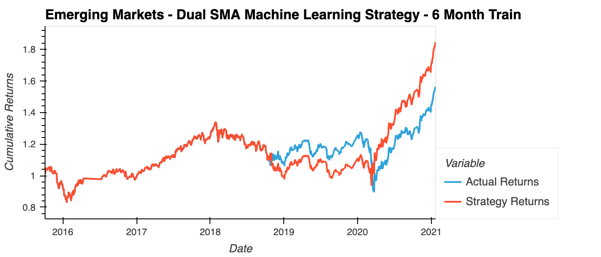
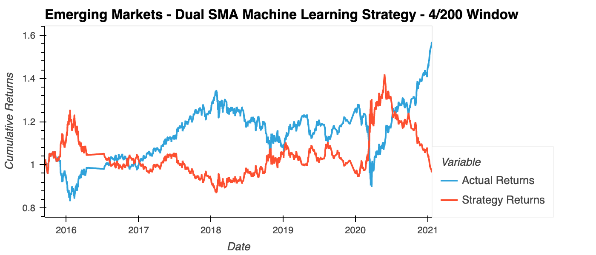

# Machine Learning Based Trading Strategies for Emerging Markets

This Jupyter notebook creates, trains, and evaluates machine learning models to automate trading decisions for emerging markets investing.

Specifically, it carries out the following steps:
1. Implements a baseline trading strategy based on dual Simple Moving Averages (SMAs) using the Support Vector Machine (SVM) SVC model.
2. Adjusts the training data size and the moving average windows to optimize the algorithm. 
3. Trains a model using a different machine learning model and compares its performance to the baseline model.

---

## Technologies

This Jupyter notebook makes use of the following Python libraries:
* Pandas
* PyViz - Holoviews and hvPlot library
* Datetime
* Numpy
* Matplotlib
* scikit-learn

---

## Installation Guide

To use this notebook:
* Install Jupyter lab Version 2.3.1 and Python 3.7.
* Pandas should already be included in the dev environment distribution.  If not, install it.
* Install scikit-learn.
* Install PyViz visualization package.
* Install hvPlot version 0.7.0 or later.
* Install NodeJS version 12 or later.

Open the notebook in Jupyter lab and you can rerun the analysis.

---

## Machine Learning Models
### Baseline SVC Model

#### Classification Report
```
              precision    recall  f1-score   support

        -1.0       0.43      0.04      0.07      1804
         1.0       0.56      0.96      0.71      2288

    accuracy                           0.55      4092
   macro avg       0.49      0.50      0.39      4092
weighted avg       0.50      0.55      0.43      4092
```



The baseline model had an accuracy of 55%.  The Strategy Cumulative Returns were 151.8%, and the Actual Cumulative Returns of the emerging markets data were 138.7%.  So for the baseline case, the model performed 13.1% better than the underlying assets.

### 6-month Trained model

#### Classification Report
```
              precision    recall  f1-score   support

        -1.0       0.44      0.02      0.04      1732
         1.0       0.56      0.98      0.71      2211

    accuracy                           0.56      3943
   macro avg       0.50      0.50      0.38      3943
weighted avg       0.51      0.56      0.42      3943
```


When the model was trained with 6 months of data instead of 3, overall the model performed better than the baseline.  The accuracy went up to 56%, the Strategy Cumulative Returns went up to 184.2%, and the Actual Cumulative Returns of the emerging markets data went up to 156.0%.  Note there was a period about 1 year where the model performed worse than the underlying assets, but in the end the model performed 28.2% better than the underlying assets.

Note the reason the Actual Cumulative Returns went up compared to the baseline was because the 6 months of training data changed the amount of data available used by the cumulative product comparison.

### SMA Window Tuned Model

#### Classification Report
```

              precision    recall  f1-score   support

        -1.0       0.44      0.85      0.58      1740
         1.0       0.58      0.16      0.25      2227

    accuracy                           0.47      3967
   macro avg       0.51      0.51      0.42      3967
weighted avg       0.52      0.47      0.40      3967
```



When the SMA fast/slow windows were changed from 4/100 days to 4/200 days, it had a negative impact on the model.  The accuracy went down to 47%, the Strategy Cumulative Returns went down to 96.6%, and the Actual Cumulative Returns of the emerging markets data went up to 156.6%.

Note the reason the Actual Cumulative Returns went up compared to the baseline was because the 200-day window changed the amount of data available used by the cumulative product comparison.

## Conclusion

---

## Contributors

Michael Danenberg

---

## License

MIT